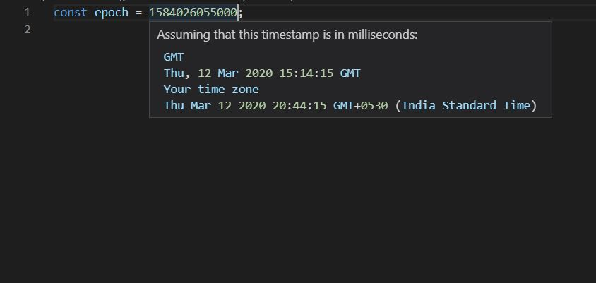

# Timestamp Converter

## Description

Convert epoch to human-readable date.
This extension was inspired by https://www.epochconverter.com/

## Features

Hover on the epoch time, it will be converted to human readable format

Currently this extension is capable to do the following conversions, where the epoch time can be formated in seconds, milliseconds or nanoseconds, and custom is a localized format.

Epoch times can be converted to a human readable timestamp.

For example :

## Release Notes

### 1.0.0

Initial release of timestamp converter

**Enjoy!**
